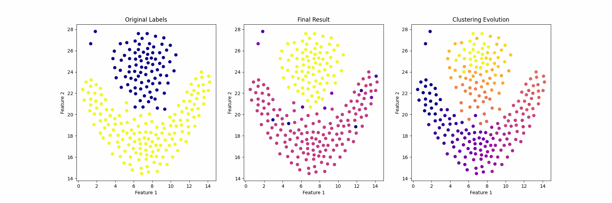
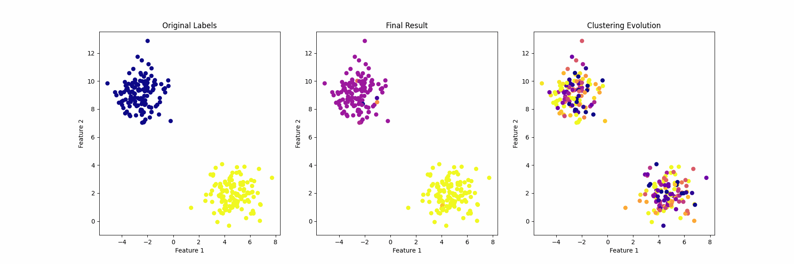

# A Novel Reinforcement Learning Based Clustering Approach

## Methodology

The goal is to create a clustering algorithm based in relationships between agents.
Each point goal is to gatter alies to survive a combat.
When a point survive a combat, it strenghtens its relationships with its
teammates.
If a point loses a combat, it will weaken its relationships with its 
teammates.
The strength of a point is based in the distance from its teammates, thus, the
closer the teammates, the stronger the point.

## Pseudocode

1. Initialize the points with unique labels and random relationships between 
them
2. Update the labels according to the relationships
3. The point will get the label with strongest relationship
4. It can exist a table with the total relationship with that label
5. At the first iteration, the point will get the label of the point with the 
highest relationship, because of the unique labels
6. The train begins
7. The points will dispute with the closest n points with different labels
8. The point wins if its strength is higher than the other point
9. The point's strength is the sum of the distances to all other points with
the same label (this will encourage points to team up with closer ponints)
10. After the combat, the point will store a score with the sum of all disputes
11. The dispute result is the point's strength minus the other point's 
strength, thus, if it loses, the result will be negative
12. The point will update its relationships with its teammates. The update
will be proportional to the dispute result (e.g.: update * dispute_result)
13. After updating its relationships, the point will update its label
14. Go back to step 7

## Execution

## References

- [A multi-agent-based algorithm for data clustering](https://link.springer.com/article/10.1007/s13748-020-00213-3)
- [A novel clustering approach: Artificial bee colony (ABC) algorithm](https://www.researchgate.net/publication/288244743_A_novel_clustering_approach_Artificial_bee_colony_ABC_algorithm)
- [The Dynamics of Collective Sorting Robot - Like Ants And Ant - Like Robots](https://ieeexplore.ieee.org/document/6294124)

